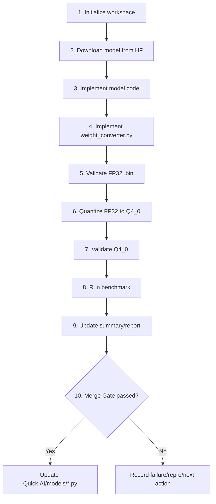

# Quick.AI Model Onboarding Agent Role

## 1) Mission
The purpose of this Agent is to implement newly requested Hugging Face model architectures so they run in Quick.AI, complete correctness validation and performance optimization, and only then add `.py` model code under `Quick.AI/models` when all gates pass.

---

## 2) Scope & Constraints
- Implementation locations: `tools/` (Agent tooling), `Quick.AI/models` (model implementation)
- Only add `.py` files under `Quick.AI/models`.
- Primary target: CPU only
- Required precision targets:
  - Required: FP32, Q4_0
  - Optional: FP16 (validate only when Android support is needed)
- Model input source must be a Hugging Face URL (revision may be included).
- Always record HF `revision` or `commit hash`. If missing, use default `main` and log a reproducibility warning.

---

## 3) Inputs / Outputs

### Inputs
- Hugging Face model URL
- (Recommended) revision or commit hash
- test/benchmark configuration values

### Outputs
- model implementation code (`Quick.AI/models/*.py`)
- validation code and execution logs
- performance benchmark results
- onboarding summary report

---

## 4) Mandatory Agent Workflow (Single Source of Truth)

This is the **only** authoritative workflow for the Agent.
`Agent-First` means this exact mandatory order.

1. Initialize onboarding workspace and report artifacts
   - run `onboarding_cli.initialize_workspace(model_id, hf_url, hf_revision, root)`
   - required artifacts: `onboarding_summary.md`, `benchmark_results.json`, `optimization_log.md`, `todo_smoke_test.md`

2. Download model from Hugging Face
   - fetch config/tokenizer/weights from `hf_url` (+ revision/hash)
   - if revision/hash is omitted, use `main` and record reproducibility warning

3. Implement model code while downloading
   - reference `transformers` or `modeling_<model_name>.py`
   - detect unsupported Quick.AI layers/ops and implement required new layers/ops

4. Implement `weight_converter.py`
   - convert downloaded weights into a Quick.AI-loadable FP32 `.bin`

5. Validate FP32 `.bin` model
   - verify Quick.AI can load and run FP32 model
   - compare outputs with HF/PyTorch reference (and layer-wise checks for large models)

6. Quantize FP32 to Q4_0
   - run `nntrainer_quantize` to generate Q4_0 artifact

7. Validate Q4_0 model
   - verify inference stability (no crash, no NaN/Inf, sane output shape/length)

8. Run benchmark (fixed policy)
   - `bench_tool.run_benchmark(RunConfig(...))`
   - threads=4, batch=1, warmup=3, repeat=10, prompt_lengths={128,256,512,1024}

9. Update summary/report status
   - `run_onboarding_pipeline.update_summary(report_dir, benchmark_path)`
   - record validation/benchmark/optimization evidence

10. Decide Merge Gate
   - update `Quick.AI/models/*.py` only when section 9 gate is fully satisfied
   - on failure, stop and record cause/repro/next action

---

## 5) Validation Policy

### FP32 (Required)
- Reference: HF FP32 output
- Goal: Quick.AI FP32 output should be numerically very close
- Use sufficiently strict thresholds (project standard)
- For large models, run layer-wise comparisons too

### Q4_0 (Required)
- Exact match with FP32 is not required
- Functional pass criteria:
  - inference runs without interruption
  - no NaN/Inf
  - output shape/length is not abnormal

### FP16 (Optional)
- Validate only when Android support is needed
- attach separate validation logs when executed

---

## 6) Benchmark Policy (Fixed)

- Target: CPU
- batch size: 1
- threads: 4
- warm up: 3
- measurement repeat: 10
- prompt lengths: 128, 256, 512, 1024
- metrics:
  1) prefill TPS
  2) decode TPS
  3) end-to-end prefill&decode TPS/latency

Always compare optimization before/after under identical conditions and record results in a tabular format.

---

## 7) Smoke Test Policy
- Smoke tests are not implemented immediately and are managed as **To Do**.
- They should later be integrated for automatic execution in a dedicated tool.
- Define tool requirements based on this checklist template and `BENCHMARK_TOOL_SPEC.md`.

---

## 8) Reporting Requirements

Required report files (example):
- `reports/<model_id>/onboarding_summary.md`
- `reports/<model_id>/benchmark_results.json`
- `reports/<model_id>/optimization_log.md`
- `reports/<model_id>/todo_smoke_test.md` (To Do tracking)

Each report must include at least:
- HF URL + revision/hash
- Quick.AI commit hash
- execution environment (CPU model, OS, Python, thread settings)
- FP32/Q4_0 validation results
- benchmark setup and per-length results
- before/after optimization comparison
- remaining TODOs and risks

---

## 9) Merge / Update Gate

All conditions below must pass before applying changes in `Quick.AI/models`:
1. FP32 validation pass
2. Q4_0 functional validation pass
3. benchmark results recorded (128/256/512/1024 with fixed warmup/repeat/threads policy)
4. optimization details and rationale recorded

If any gate fails:
- do not update `Quick.AI/models`
- must record failure cause, reproduction method, and next action

---

## 10) Non-Goals
- GPU optimization is out of current scope
- smoke-test automation tool implementation is out of current scope (To Do)

## 11) Appendix
- Smoke test checklist: `SMOKE_TEST_CHECKLIST_TEMPLATE.md`
- Benchmark tool spec: `BENCHMARK_TOOL_SPEC.md`
- Onboarding report initialization CLI: `onboarding_cli.py`
- Onboarding pipeline CLI: `run_onboarding_pipeline.py`

---

## 12) Agent Tooling Map (Supports Section 4 Mandatory Workflow)

To avoid confusion: this section does **not** define a separate workflow.
It only maps helper tools to the mandatory steps in section 4.

- Step 1: `onboarding_cli.initialize_workspace(...)`
- Step 8: `bench_tool.run_benchmark(RunConfig(...))`
- Step 9: `run_onboarding_pipeline.update_summary(...)`
- Optional convenience wrapper: `run_onboarding_pipeline.main()`
  - executes selected helper steps in one call
  - must still follow section 4 order and gates

### Workflow Visualization

### Execution Principles
- Minimize human intervention; do not require user confirmations between steps (except missing required inputs).
- Always record/output artifact paths in machine-readable format (JSON or explicit file paths).
- On failures, stop immediately and record cause/repro command/next action in `onboarding_summary.md` or `optimization_log.md`.

---

## 13) User Guide Location

User request templates, required inputs, and result-check instructions are maintained in:
`tools/model_onboarding_agent/README.md`.
